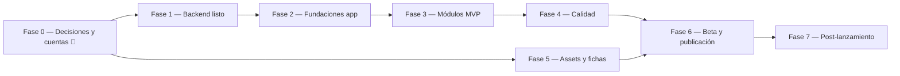

# Plan de Orquestación — App Móvil "Gestión Cristiana TMDV"

> **Objetivo:** construir y publicar en **App Store (iOS)** y **Google Play (Android)** una app móvil nativa que consuma la API del sistema web actual (`server/`), sin romper la web existente (`client/`).
>
> **Documento hermano:** [DISENO_UI_UX.md](DISENO_UI_UX.md) — guía de diseño/UI/UX para producir las pantallas en Claude.

| Campo | Valor |
|---|---|
| Versión del plan | 1.0 |
| Fecha | 2026-09-24 |
| Repo | `gustavodavidpv/gestion-cristiana-tmdv` |
| Carpeta de la app | `mobile/` (hermana de `client/` y `server/`) |
| Estado global | ◐ App Flutter en `mobile/` (Fases 2–3 con código; backend Fase 1 pendiente) |

---

## 0. Cómo usar este plan (orquestación y hand-off)

### 0.1 Roles

| Rol | Quién | Responsabilidad |
|---|---|---|
| **Orquestador** | Sesión principal de Claude Code + Gustavo | Reparte tarjetas, revisa DoD, mantiene el tablero y el `HANDOFF_LOG.md` |
| **Agente Backend** | Sesión/subagente sobre `server/` | Fase 1 (endurecer API, contratos, auth móvil) |
| **Agente Mobile** | Sesión/subagente sobre `mobile/` | Fases 2 y 3 (fundaciones + módulos) |
| **Agente QA** | Sesión/subagente | Fase 4 (pruebas, matriz de permisos, checklist de review) |
| **Agente Release** | Sesión/subagente | Fases 5–6 (assets, fichas de tienda, builds EAS, envíos) |
| **Humano (PO)** | Gustavo | Todo lo que un agente **no puede** hacer: pagar cuentas, D-U-N-S, aceptar contratos, subir a las tiendas, credenciales, decisiones de negocio |

> ⚠️ **Las tarjetas marcadas 🧍 son exclusivamente humanas.** Un agente nunca crea cuentas, ni introduce datos de pago, ni acepta términos de Apple/Google.

### 0.2 Protocolo de hand-off (obligatorio para cada tarjeta)

1. **Tomar la tarjeta:** el agente lee esta sección + la tarjeta completa + los archivos listados en *Contexto a leer*.
2. **Rama:** `mobile/<id-tarjeta>-<slug>` (ej. `mobile/t1.3-refresh-tokens`). Nunca trabajar directo en `main`.
3. **Ejecutar** los pasos. Si aparece una decisión no prevista: **parar y preguntar al Orquestador**, no improvisar contratos de API.
4. **Verificar** contra el *DoD* (Definition of Done) de la tarjeta.
5. **Registrar el hand-off:** añadir una entrada a `docs/mobile/HANDOFF_LOG.md` con la plantilla de §9.1.
6. **PR** con título `[<id-tarjeta>] <resumen>` y el cuerpo apuntando a la entrada del log.
7. **Marcar** la casilla de la tarjeta en el tablero (§0.4) y avisar al Orquestador qué tarjeta queda desbloqueada.

### 0.3 Reglas globales para todos los agentes (guardrails)

- **No romper la web.** Todo cambio en `server/` es retrocompatible: no se renombran campos ni rutas existentes; lo nuevo se agrega. Si un cambio obliga a tocar `client/`, va en el mismo PR.
- **Idioma:** toda la UI, mensajes de error y comentarios de código en **español**.
- **Zona horaria:** `America/Panama` (UTC-5, sin DST). Las fechas de eventos se envían en **ISO 8601 con offset explícito** (`2026-04-26T19:00:00-05:00`) — es un contrato ya documentado en `server/controllers/eventController.js`.
- **Permisos:** la UI móvil **nunca** decide por rol hardcodeado; siempre por el mapa de `GET /api/auth/my-permissions` (módulo + acción). El backend vuelve a validar siempre.
- **Multi-iglesia:** SuperAdmin puede consultar cualquier iglesia vía `?church_id=`; el resto queda filtrado por el backend (`applyTenantFilter`).
- **Secretos:** nunca en el repo. Tokens de tienda y claves de firma viven en EAS/variables de entorno.
- **Sin dependencias sorpresa:** cualquier librería nueva se justifica en el PR (peso, mantenimiento, si requiere código nativo).
- **Datos sensibles:** la app maneja datos de menores (Club Bíblico) y afiliación religiosa. Nada de logs con datos personales, nada de analítica de terceros sin decisión explícita del PO.

### 0.4 Tablero de estado

| # | Tarjeta | Dueño | Depende de | Estado |
|---|---|---|---|---|
| T0.1 | Decisiones de producto y marca | 🧍 PO | — | ☐ |
| T0.2 | Cuenta Apple Developer | 🧍 PO | T0.1 | ☐ |
| T0.3 | Cuenta Google Play Console | 🧍 PO | T0.1 | ☐ |
| T0.4 | Dominio propio + plan de hosting | 🧍 PO + Backend | T0.1 | ☐ |
| T0.5 | Documentos legales (privacidad, términos, soporte) | 🧍 PO + Backend | T0.1 | ☐ |
| T1.1 | Cerrar registro público y fugas de autorización | Backend | — | ☐ |
| T1.2 | Rate limiting + cabeceras seguras | Backend | T1.1 | ☐ |
| T1.3 | Sesión móvil: refresh tokens + logout | Backend | T1.1 | ☐ |
| T1.4 | Endpoint de configuración y versión mínima | Backend | — | ☐ |
| T1.5 | Recuperar contraseña real (correo) | Backend | T1.2 | ☐ |
| T1.6 | Eliminación/solicitud de baja de cuenta | Backend | T1.3 | ☐ |
| T1.7 | URLs absolutas de archivos y logos | Backend | — | ☐ |
| T1.8 | Contrato OpenAPI de la API móvil | Backend | T1.3, T1.4 | ☐ |
| T1.9 | Páginas públicas legales servidas por Express | Backend | T0.5 | ☐ |
| T1.10 | Infra: dominio, plan sin “sueño”, health y monitoreo | Backend | T0.4 | ☐ |
| T2.1 | Scaffold Flutter en `mobile/` (antes Expo, ver ADR-01) | Mobile | T0.1 | ◐ |
| T2.2 | Entornos, `app.config.ts` y `eas.json` | Mobile | T2.1, T0.4 | ☐ |
| T2.3 | Cliente API + sesión segura (SecureStore, refresh, 401) | Mobile | T2.2, T1.3 | ◐ |
| T2.4 | Contexto de permisos + selector de iglesia | Mobile | T2.3, T1.8 | ◐ |
| T2.5 | Design system + navegación | Mobile | T2.1, `DISENO_UI_UX.md` | ◐ |
| T2.6 | Utilidades: fechas Panamá, descargas, subidas | Mobile | T2.3, T1.7 | ◐ |
| T2.7 | Errores, offline y estado vacío/carga globales | Mobile | T2.5 | ◐ |
| T3.1 | Login, branding y recuperación | Mobile | T2.x, T1.5 | ◐ |
| T3.2 | Dashboard | Mobile | T2.x | ◐ |
| T3.3 | Miembros | Mobile | T2.x | ◐ |
| T3.4 | Eventos, asistencia y decisiones de fe | Mobile | T2.x | ◐ |
| T3.5 | Asistencia semanal | Mobile | T2.x | ◐ |
| T3.6 | Club Bíblico | Mobile | T2.x | ◐ |
| T3.7 | Actas (lectura, descarga, adjuntar) | Mobile | T2.6 | ◐ |
| T3.8 | Perfil, ajustes y acerca de | Mobile | T2.3, T1.6 | ◐ |
| T4.1 | Pruebas unitarias y de contrato | QA | T3.x | ◐ |
| T4.2 | E2E por rol (Maestro) | QA | T3.x | ☐ |
| T4.3 | Matriz de permisos verificada en dispositivo | QA | T3.x | ◐ |
| T4.4 | Accesibilidad, rendimiento y red pobre | QA | T3.x | ☐ |
| T4.5 | Checklist pre-review (Apple 4.2/2.1/5.1.1) | QA | T4.1–T4.4 | ☐ |
| T5.1 | Icono, splash y paleta final | Release | T0.1 | ☐ |
| T5.2 | Capturas de pantalla para ambas tiendas | Release | T3.x | ☐ |
| T5.3 | Textos de ficha (ASO) | Release + 🧍 PO | T0.1 | ☐ |
| T5.4 | Privacidad: App Privacy (Apple) + Data safety (Google) | Release + 🧍 PO | T0.5 | ☐ |
| T5.5 | Cuenta demo para revisores | Backend + 🧍 PO | T1.1 | ☐ |
| T6.1 | Perfiles de build EAS y primer binario | Release | T2.2 | ☐ |
| T6.2 | TestFlight (beta iOS) | Release + 🧍 PO | T6.1, T0.2 | ☐ |
| T6.3 | Pruebas internas y cerradas en Play | Release + 🧍 PO | T6.1, T0.3 | ☐ |
| T6.4 | Envío a revisión y respuesta a rechazos | Release + 🧍 PO | T4.5, T5.x, T6.2, T6.3 | ☐ |
| T7.1 | OTA, versionado y política de actualización | Release | T6.4 | ☐ |
| T7.2 | Monitoreo post-lanzamiento y soporte | Backend + 🧍 PO | T6.4 | ☐ |

---

## 1. Contexto verificado del sistema actual

*(Leído del código el 2026-09-21; si algo cambió, el agente lo corrige aquí en el mismo PR.)*

### 1.1 Stack

| Capa | Tecnología | Archivo clave |
|---|---|---|
| Backend | Node ≥18 + Express 4 | `server/index.js` |
| ORM/BD | Sequelize 6 + PostgreSQL (timezone `-05:00`) | `server/config/database.js` |
| Auth | JWT `Bearer`, expira en 24h, sin refresh | `server/middleware/auth.js`, `server/controllers/authController.js` |
| RBAC | Permisos dinámicos por rol: `módulo.acción`, con `DEFAULTS` de respaldo | `server/config/permissions.js` |
| Multi-tenant | `church_id` en cada tabla; SuperAdmin cruza iglesias | `applyTenantFilter` en `server/middleware/auth.js` |
| Web | React 18 (CRA) + MUI 5 + axios + PWA | `client/src/` |
| Deploy | Render.com (web service + Postgres), build de React servido por Express | `render.yaml` |
| Extras | PDFKit (calendarios/posiciones), Multer (actas/logos), node-cron + WhatsApp Cloud API | `server/utils/` |

### 1.2 Modelo de permisos (lo que debe replicar la app)

Módulos: `dashboard`, `members`, `churches`, `events`, `weekly_attendance`, `minutes`, `bible_club`, `notifications`, `positions`, `branding`, `users`.
Acciones: `view`, `create`, `edit`, `delete` y `attendance` (solo `events`).
Roles del sistema: `SuperAdmin` (bypass total), `Administrador`, `Secretaría`, `Líder`, `Asistencia`, `Visitante`.
La app pide **`GET /api/auth/my-permissions`** al iniciar sesión y guarda el mapa completo.

### 1.3 Inventario de endpoints (contrato para la app)

| Módulo | Endpoint | Permiso | ¿v1.0 móvil? |
|---|---|---|---|
| Auth | `POST /api/auth/login` | público | ✅ |
| Auth | `GET /api/auth/me` | autenticado | ✅ |
| Auth | `GET /api/auth/my-permissions` | autenticado | ✅ |
| Auth | `POST /api/auth/forgot-password` · `POST /api/auth/reset-password` | público | ✅ (tras T1.5) |
| Auth | `POST /api/auth/register` | público ⚠️ | ❌ — se cierra en T1.1 |
| Auth | `POST /api/auth/admin-reset-password/:userId` | Administrador | ❌ (web) |
| Branding | `GET /api/branding/:churchId` | público | ✅ (login + encabezado) |
| Iglesias | `GET /api/churches` | `churches.view` | ✅ (selector SuperAdmin) |
| Iglesias | `GET /api/churches/my/summary?year` | `dashboard.view` | ✅ |
| Iglesias | `GET /api/churches/stats/dashboard?year` | SuperAdmin | ✅ |
| Iglesias | `GET /api/churches/:id` | `churches.view` | ✅ (solo lectura) |
| Iglesias | `POST/PUT/DELETE` iglesias, misiones, campos blancos | varios | ❌ (web) |
| Miembros | `GET /api/members?search&member_type&position_id&baptized&birth_month&page&limit&church_id` | `members.view` | ✅ |
| Miembros | `GET/POST/PUT/DELETE /api/members/:id` | `members.*` | ✅ |
| Cargos | `GET /api/ministerial-positions` | `positions.view` | ✅ (catálogo; ver nota 1.5.d) |
| Eventos | `GET /api/events?church_id&event_type&start_date&end_date&page&limit` | `events.view` | ✅ |
| Eventos | `POST/PUT/DELETE /api/events/:id` | `events.*` | ✅ |
| Eventos | `POST /api/events/:id/attendees` | `events.attendance` | ✅ (caso de uso estrella) |
| Eventos | `GET /api/events/calendar-pdf?year&month` · `sales-calendar-pdf?year` | `events.view` | ✅ (descargar/compartir) |
| Asistencia | `GET/POST/PUT/DELETE /api/weekly-attendance` | `weekly_attendance.*` | ✅ |
| Actas | `GET /api/minutes` · `GET /api/minutes/:id` | ⚠️ solo autenticado | ✅ (tras T1.1) |
| Actas | `POST /api/minutes/:id/upload` (multipart, ≤5 archivos, 10MB c/u) | `minutes.edit` | ✅ (foto/documento) |
| Actas | `GET /api/minutes/:id/files/:fileId/download` | `minutes.view` | ✅ |
| Actas | `POST/PUT/DELETE /api/minutes` | `minutes.*` | ❌ v1.0 (web) |
| Club Bíblico | `GET /api/bible-club/groups` · `/students` · `/transactions` | `bible_club.view` | ✅ |
| Club Bíblico | `POST /api/bible-club/transactions` (lote: `{activity_date, entries[]}`) | `bible_club.create` | ✅ |
| Club Bíblico | `POST/PUT/DELETE /students` | `bible_club.*` | ✅ |
| Club Bíblico | `GET /api/bible-club/groups/:id/standings.pdf` | `bible_club.view` | ✅ |
| Notificaciones | `/api/notifications/*` (WhatsApp) | `notifications.*` | ❌ v1.0 (web) |
| Usuarios/Roles/Permisos | `/api/users`, `/api/roles`, `/api/permissions` | varios/SuperAdmin | ❌ (web) |
| Salud | `GET /api/health` | público | ✅ (chequeo de conexión) |

### 1.4 Contratos que la app debe respetar

- **Auth:** `Authorization: Bearer <token>`; 401 ⇒ sesión inválida/expirada.
- **Listas paginadas:** `{ <recurso>: [...], pagination: { total, page, limit, pages } }` (miembros, eventos, actas, usuarios, asistencia).
- **Respuestas simples:** `{ <recurso>: {...}, message }`. Errores: `{ message }` (y `error` en desarrollo).
- **Fechas de eventos:** ISO 8601 **con offset**; `end_date` opcional y nunca anterior a `start_date`.
- **Cumpleaños de miembros:** `birth_date` es `"MM-DD"` (sin año).
- **PDFs:** llegan como binario (`responseType: blob` en web) → en móvil se descargan con `expo-file-system` incluyendo la cabecera de auth y se abren/comparten con `expo-sharing`.
- **Subidas:** `multipart/form-data`, campo `files` (actas, máx. 5) o `logo` (branding).
- **Club Bíblico, alta de puntos:** `POST /transactions` con `{ activity_date, entries: [{ student_id, points, type, reason, item, notes }] }`; `type: 'redeem'` siempre descuenta.

### 1.5 Hallazgos del código que condicionan el lanzamiento

| # | Hallazgo | Impacto | Se resuelve en |
|---|---|---|---|
| a | `POST /api/auth/register` es **público y acepta `role_id` arbitrario** → cualquiera puede crearse un usuario (incluso con rol privilegiado) | 🔴 Crítico. Bloquea publicar en tiendas | T1.1 |
| b | `GET /api/minutes` y `/:id` solo exigen `authenticate`, sin `authorizePermission('minutes','view')` | 🟠 Roles sin permiso de actas pueden leerlas | T1.1 |
| c | Sin rate limiting ni `helmet`; login y recuperación expuestos a fuerza bruta | 🟠 | T1.2 |
| d | `Members` necesita el catálogo de `GET /api/ministerial-positions`, pero `Secretaría`/`Líder` tienen `positions.view = false` → 403 | 🟡 La app debe degradar el campo sin romperse (o el PO amplía el permiso) | T3.3 |
| e | Recuperación de contraseña guarda códigos en un `Map` en memoria y **no envía correo**: en producción no funciona | 🟠 Un revisor de tienda puede probarlo | T1.5 |
| f | Los logos se **escriben** en `server/public/uploads/logos` pero se **sirven** desde `UPLOAD_PATH/logos`: si `UPLOAD_PATH` está definido en producción, el logo subido no se sirve | 🟡 Verificar en el entorno real | T1.7 |
| g | `login_logo_url` y `file_url` son rutas relativas (`/uploads/...`): la app necesita URL absoluta | 🟡 | T1.7 |
| h | JWT de 24h sin refresh: la app cerraría sesión cada día | 🟠 UX inaceptable en móvil | T1.3 |
| i | `render.yaml` declara plan `free`: el servicio se duerme tras ~15 min de inactividad (arranque en frío de decenas de segundos) | 🟠 Falla el review de Apple (guideline 2.1) y arruina la primera impresión | T1.10 |
| j | No hay versionado de API (`/api/v1`) ni verificación de versión mínima de cliente | 🟡 Un binario publicado no se puede “forzar” a actualizar | T1.4 |

---

## 2. Decisiones de arquitectura (ADR)

| # | Decisión | Por qué | Alternativa descartada |
|---|---|---|---|
| ADR-01 | ~~React Native + Expo~~ → **Flutter (Dart)** en `mobile/` — *revisado 2026-09-24 por decisión del PO* | UI nativa compilada (sin riesgo Apple 4.2), un solo código para iOS/Android, entorno ya instalado en el equipo. iOS se compila en la nube (Codemagic o GitHub Actions macOS) ⇒ sigue sin hacer falta una Mac. Equivalencias: Expo Router → `go_router`, TanStack Query → Riverpod, SecureStore → `flutter_secure_storage`, RN Paper → tema propio Broadsheet, EAS Update → sin OTA nativo (Shorebird opcional). Ver `mobile/README.md` | *Expo*: plan original; descartado por el PO. *Capacitor envolviendo la web*: riesgo alto de rechazo por Apple 4.2 |
| ADR-02 | **Dart con tipos estrictos** en la app (antes: TypeScript) | Los contratos de la API se tipan en `mobile/lib/data/models.dart`; cuando exista el OpenAPI (T1.8) se puede generar el cliente | Mapas sin tipar |
| ADR-03 | **Expo Router** (navegación por archivos) + **bottom tabs** | Deep links gratis (`gctmdv://evento/12`), estructura predecible para agentes | React Navigation manual |
| ADR-04 | **TanStack Query** para datos remotos | Caché, reintentos, scroll infinito y revalidación resuelven la paginación existente y la red móvil inestable | fetch + useState |
| ADR-05 | **React Native Paper (Material 3)** como base visual | Es lo más cercano a la MUI de la web ⇒ continuidad visual con `#1565C0` | UI kit propio desde cero |
| ADR-06 | **`expo-secure-store`** para tokens (Keychain/Keystore) | Nunca en AsyncStorage ni en logs | localStorage-like |
| ADR-07 | **API compartida sin cambios de ruta**; lo móvil se agrega (`/api/auth/refresh`, `/api/app/config`) | La web sigue funcionando sin tocar su código | Versionar todo a `/api/v2` |
| ADR-08 | **Los módulos de administración (usuarios, roles, permisos, branding, notificaciones) quedan en la web** en v1.0 | Menor superficie de revisión, menos riesgo, foco en los casos de uso que ocurren *de pie, con el teléfono en la mano* | Paridad total desde el día 1 |

---

## 3. Alcance

### 3.1 v1.0 (lo que se publica)

| Módulo | Qué hace en el teléfono |
|---|---|
| **Login** | Branding de la iglesia, recordar sesión, biometría opcional, recuperar contraseña |
| **Dashboard** | Indicadores del año (miembros, eventos, actas, decisiones de fe, asistencia promedio), selector de año, vista SuperAdmin con comparativo por iglesia |
| **Miembros** | Buscar, filtrar (tipo, cargo, bautizado, mes de cumpleaños), ver ficha, crear/editar/eliminar según permiso, **llamar y escribir por WhatsApp con un toque** |
| **Eventos** | Agenda por mes/lista, detalle, crear/editar, **registrar asistentes y decisiones de fe en el momento**, descargar/compartir calendario PDF |
| **Asistencia semanal** | Registro rápido de la semana, promedio/máx/mín del año |
| **Club Bíblico** | Salones, participantes, **hoja de puntos del día**, canjes, historial por participante, tabla de posiciones en PDF |
| **Actas** | Lista, detalle (asistentes, motivos/acuerdos), descargar archivos, **adjuntar foto del acta desde la cámara** |
| **Perfil** | Datos, iglesia, rol, cambiar contraseña, cerrar sesión, versión, aviso de privacidad, solicitar baja de cuenta |

### 3.2 Fuera de v1.0 (backlog v1.1+)

Notificaciones push propias (APNs/FCM) · OCR de la hoja de asistencia en el teléfono (ML Kit; `tesseract.js` **no** funciona en React Native) · Modo offline con cola de escritura · Crear/editar actas completas con motivos y votantes · Administración de usuarios/roles/permisos/branding · Tablet/iPad · Modo oscuro completo · Widget de próximo culto.

---

## 4. Mapa de fases y ruta crítica



**Ruta crítica real (empezar hoy, aunque no haya una línea de código):**

1. **Inscripción en Apple como organización** puede tardar semanas (requiere número **D-U-N-S**, gratuito pero lento). → T0.2 primero.
2. **Google Play: cuentas personales creadas después de nov-2023 deben correr una prueba cerrada con ≥12 probadores durante 14 días seguidos** antes de poder publicar en producción. Las cuentas de organización están exentas. → T0.3 y T6.3 se planifican con ese colchón.
3. El plan de hosting sin “sueño” (T1.10) debe estar activo **antes** de enviar a revisión.

**Estimación orientativa** (1 dev + agentes): Fase 0 en paralelo 1–3 sem · Fase 1: 1–2 sem · Fase 2: 1 sem · Fase 3: 3–5 sem · Fase 4: 1–2 sem · Fase 5: 1 sem (en paralelo) · Fase 6: 2–4 sem (dominadas por los tiempos de tienda). **Total realista: 2,5–4 meses hasta “disponible”.**

---

## 5. Fases y tarjetas

### Fase 0 — Decisiones, cuentas y legal 🧍

#### T0.1 — Decisiones de producto y marca
**Dueño:** PO · **Depende de:** — · **Estado:** ☐

**Decisiones a cerrar (sin esto no arranca nada):**

| Decisión | Opciones | Recomendación |
|---|---|---|
| Nombre en tiendas | “Gestión Cristiana TMDV” / otro | Nombre corto + subtítulo descriptivo (§5 T5.3) |
| Bundle ID / package | `org.tmdv.gestioncristiana` | Uno solo, igual en iOS y Android, **irreversible** |
| Titular de las cuentas | Persona natural / Organización | **Organización** (la ficha muestra el nombre del ministerio y evita migraciones futuras) |
| Distribución en App Store | Pública / **No listada** (solo por enlace) | Si la app es solo para personal de las iglesias TMDV, evaluar **no listada**: reduce el riesgo de rechazo por “app para una organización específica”. Si se posiciona como plataforma multi-iglesia, pública |
| Alcance v1.0 | El de §3.1 | Confirmar o recortar |
| Idioma | Solo español | Sí (es-419) |
| Correo de soporte y URL de soporte | — | Necesarios para ambas tiendas |

**DoD:** tabla anterior completada y pegada en `HANDOFF_LOG.md`.

#### T0.2 — Cuenta Apple Developer 🧍
**Depende de:** T0.1 · **Estado:** ☐

**Pasos:** obtener **D-U-N-S** de la organización (gratis, puede tardar días/semanas) → inscribirse en el **Apple Developer Program (USD 99/año)** → verificar si aplica **exención de cuota para organizaciones sin fines de lucro** en Panamá → crear el App ID con el bundle de T0.1 → invitar al equipo (rol Admin/App Manager) → aceptar los contratos de Apple en App Store Connect.
**DoD:** se puede crear un registro de app en App Store Connect con el bundle definitivo.

#### T0.3 — Cuenta Google Play Console 🧍
**Depende de:** T0.1 · **Estado:** ☐

**Pasos:** crear cuenta de desarrollador (**USD 25, pago único**), preferiblemente de **organización** (requiere D-U-N-S y evita la exigencia de 12 probadores/14 días) → verificación de identidad → aceptar el acuerdo de distribución → crear la app → activar **Play App Signing**.
**DoD:** app creada en Play Console y lista para recibir un AAB interno.

#### T0.4 — Dominio propio y plan de hosting 🧍 + Backend
**Depende de:** T0.1 · **Estado:** ☐

**Por qué:** el binario publicado lleva la URL de la API dentro. Si apunta a `*.onrender.com` y algún día se migra el hosting, **todas las apps instaladas se rompen** hasta una actualización aprobada por la tienda.
**Pasos:** comprar dominio (ej. `tmdv.org`) → apuntar `api.tmdv.org` (o `gestion.tmdv.org`) al servicio de Render con HTTPS → decidir plan de pago del servicio web y de Postgres (ver T1.10).
**DoD:** `https://<dominio>/api/health` responde 200 con certificado válido.

#### T0.5 — Documentos legales 🧍
**Depende de:** T0.1 · **Estado:** ☐

Redactar en español (el Agente Backend puede preparar el borrador; el PO lo revisa y aprueba):
- **Aviso de privacidad**: qué datos se recogen (nombres, teléfonos, correos, direcciones, edad, sexo, bautismo, participación en actividades, datos de menores en Club Bíblico), que la **afiliación religiosa es dato sensible**, finalidad, base legal, quién es el responsable (la iglesia), cuánto tiempo se conservan, cómo se ejercen los derechos de acceso/rectificación/eliminación, contacto. Considerar la **Ley 81 de 2019 de Panamá** (protección de datos personales) y el RGPD si hay usuarios en la UE.
- **Términos de uso**: cuentas creadas por el administrador de la iglesia, uso permitido, responsabilidad sobre los datos cargados.
- **Página de soporte** con correo de contacto.
- **Página de eliminación de cuenta** (requisito de Google Play cuando la app permite cuentas; Apple lo exige dentro de la app).

**DoD:** tres textos aprobados por el PO, listos para publicarse en T1.9.

---

### Fase 1 — Backend listo para móvil (Agente Backend)

#### T1.1 — Cerrar registro público y fugas de autorización
**Depende de:** — · **Estado:** ☐ · 🔴 **Bloqueante de lanzamiento**

**Contexto a leer:** `server/routes/auth.js`, `server/controllers/authController.js:19`, `server/routes/minutes.js`, `client/src/context/AuthContext.js:57`.
**Pasos:**
1. Eliminar la ruta pública `POST /api/auth/register` (ninguna pantalla de la web la usa; `AuthContext.register` queda huérfano → borrarlo también) **o**, si se quiere conservar, protegerla con `authenticate + authorizePermission('users','create')` y forzar que `role_id`/`church_id` respeten el tenant del solicitante.
2. Añadir `authorizePermission('minutes','view')` a `GET /api/minutes` y `GET /api/minutes/:id`.
3. Revisar que ningún controlador acepte `church_id` del body para escribir fuera del tenant cuando el usuario **no** es SuperAdmin (repasar `members`, `events`, `weekly-attendance`, `bible-club`).
4. Ocultar `error: error.message` en respuestas cuando `NODE_ENV === 'production'`.

**DoD:** un usuario `Visitante` autenticado recibe 403 en actas; `POST /api/auth/register` responde 404/401; la web sigue funcionando (login, actas, miembros) verificado a mano.
**Handoff:** avisar a T1.3 y T5.5 (cuentas demo se crean desde el panel de usuarios, ya no por registro).

#### T1.2 — Rate limiting y cabeceras seguras
**Depende de:** T1.1 · **Estado:** ☐

**Pasos:** `npm i helmet express-rate-limit` en `server/` → `app.set('trust proxy', 1)` (Render va detrás de proxy, necesario para que el límite lea la IP real) → `helmet()` con `crossOriginResourcePolicy` compatible con servir el build de React → limitador estricto en `/api/auth/login`, `/api/auth/forgot-password`, `/api/auth/reset-password` (p. ej. 10 intentos / 15 min por IP) y uno general para `/api`.
**DoD:** 11 intentos de login fallidos devuelven 429; la web y los PDFs siguen cargando.

#### T1.3 — Sesión móvil: refresh tokens + logout
**Depende de:** T1.1 · **Estado:** ☐

**Diseño:**
- Nueva tabla `refresh_tokens` (`id`, `user_id`, `token_hash`, `device_id`, `platform`, `expires_at`, `revoked_at`, `last_used_at`) creada en `server/migrations/run.js` al estilo existente.
- `POST /api/auth/login` sigue devolviendo `{ token, user }`; **si el body trae `device_id`** (lo manda la app), agrega `refresh_token` con vigencia larga (p. ej. 60 días) y `expires_in` del access token. La web no cambia.
- `POST /api/auth/refresh` `{ refresh_token, device_id }` → nuevo access token + **rotación** del refresh (invalida el anterior; si llega uno ya usado, revocar toda la familia).
- `POST /api/auth/logout` `{ refresh_token }` → revoca.
- Access token móvil corto (1–2 h).

**DoD:** pruebas manuales con `curl` documentadas en el PR: login con `device_id`, refresh, rotación, reuso rechazado, logout. La web (sin `device_id`) se comporta igual que antes.
**Handoff:** entregar a T2.3 el contrato exacto (nombres de campos y códigos de error).

#### T1.4 — Configuración remota y versión mínima
**Depende de:** — · **Estado:** ☐

**Pasos:** `GET /api/app/config` (público) → `{ min_version: { ios, android }, latest_version: {...}, store_urls: {...}, maintenance: { enabled, message }, support_email, privacy_url, terms_url, delete_account_url }`. Valores por variables de entorno para poder cambiarlos sin desplegar código. Registrar (log) las cabeceras `X-App-Version` y `X-Platform` que enviará la app.
**DoD:** endpoint responde en dev y producción; documentado en el OpenAPI (T1.8).
**Por qué importa:** es el único modo de forzar “actualiza para continuar” cuando un binario viejo quede incompatible.

#### T1.5 — Recuperación de contraseña real
**Depende de:** T1.2 · **Estado:** ☐

**Pasos:** persistir el código en BD (`password_resets`: `user_id`, `code_hash`, `expires_at`, `attempts`, `used_at`) en vez del `Map` en memoria → enviar por correo con un proveedor con plan gratuito (Resend/Brevo/SendGrid) configurado por variables de entorno → máximo 5 intentos, expiración 15 min, respuesta siempre genérica (no revelar si el correo existe) → **nunca** devolver el código en producción.
**DoD:** flujo completo probado con un correo real; si el proveedor no está configurado, el endpoint responde un mensaje claro y la app lo muestra como “contacta a tu administrador”.

#### T1.6 — Baja de cuenta
**Depende de:** T1.3 · **Estado:** ☐

**Pasos:** `DELETE /api/auth/me` (autenticado, pide contraseña) → desactiva la cuenta (`is_active = false`), revoca refresh tokens, registra la solicitud y notifica al administrador de la iglesia. Los **datos de la iglesia y de los miembros no se borran** (son del ministerio, no del usuario) — explicarlo en la pantalla y en el aviso de privacidad. Además, página web pública equivalente (T1.9) para cumplir con Google Play.
**DoD:** el usuario dado de baja no puede iniciar sesión; el administrador ve el usuario inactivo en la web.

#### T1.7 — URLs absolutas de archivos y logos
**Depende de:** — · **Estado:** ☐

**Pasos:**
1. Verificar en el entorno real si `UPLOAD_PATH` está definido; si lo está, **corregir `server/routes/branding.js`** para escribir los logos en `UPLOAD_PATH/logos` (hoy escribe en `server/public/uploads/logos`, que no es lo que sirve `index.js`).
2. Exponer en las respuestas de branding y de archivos de actas una URL absoluta (`https://<dominio>/uploads/...`) o documentar explícitamente el prefijo que debe usar el cliente.

**DoD:** subir un logo desde la web y verlo en `GET /api/branding/:id` como URL absoluta que abre correctamente en un navegador móvil.

#### T1.8 — Contrato OpenAPI de la API móvil
**Depende de:** T1.3, T1.4 · **Estado:** ☐

**Pasos:** escribir `docs/api/openapi.yaml` (OpenAPI 3.1) cubriendo **todos los endpoints marcados ✅ en §1.3**, con esquemas de request/response, códigos de error, parámetros de paginación y el `securityScheme` bearer. Validar con `npx @redocly/cli lint`.
**DoD:** el archivo valida sin errores y `npx openapi-typescript docs/api/openapi.yaml -o mobile/src/api/schema.ts` genera tipos usables.
**Handoff:** este archivo es **la fuente de verdad** para el Agente Mobile; cualquier discrepancia se corrige aquí primero.

#### T1.9 — Páginas legales públicas
**Depende de:** T0.5 · **Estado:** ☐

**Pasos:** publicar `client/public/privacidad.html`, `terminos.html`, `soporte.html` y `eliminar-cuenta.html` (HTML estático simple con el estilo de la marca). Express ya los sirve desde el build; verificar que el comodín SPA no los intercepte.
**DoD:** las cuatro URLs cargan en producción y son enlazables desde las fichas de tienda y desde la app.

#### T1.10 — Infraestructura lista para producción
**Depende de:** T0.4 · **Estado:** ☐

**Pasos:** subir el servicio web y la base de datos a un plan **de pago** (el plan gratuito de Render duerme el servicio tras ~15 min y las bases gratuitas caducan) → conectar el dominio propio con HTTPS → confirmar el disco persistente de uploads → activar alertas de caída y un monitor externo de `/api/health` → respaldos automáticos de Postgres verificados con una restauración de prueba.
**DoD:** dos peticiones separadas por 1 hora responden en <1 s; existe una copia de seguridad restaurada con éxito al menos una vez.

---

### Fase 2 — Fundaciones de la app (Agente Mobile)

#### T2.1 — Scaffold Expo + TypeScript
**Depende de:** T0.1 · **Estado:** ☐

**Pasos:** crear `mobile/` con Expo (SDK estable más reciente — **verificar la versión vigente al ejecutar**, no copiar una del plan), TypeScript estricto, Expo Router, ESLint + Prettier alineados con el repo, `.gitignore` propio, `mobile/README.md` con cómo correrlo en Windows (Android Studio/emulador, dispositivo físico con dev build, cómo probar iOS sin Mac).
Añadir al `package.json` raíz: `"mobile": "cd mobile && npx expo start"`.
**DoD:** `npx expo start` levanta la app en un dispositivo Android real mostrando una pantalla “Hola TMDV”.

#### T2.2 — Entornos y perfiles de build
**Depende de:** T2.1, T0.4 · **Estado:** ☐

**Pasos:** `app.config.ts` con nombre, slug, bundle ID/package de T0.1, icono/splash provisionales, `scheme` para deep links, orientación **portrait**, `userInterfaceStyle: light` (v1.0) y permisos nativos declarados con textos en español: cámara (“para adjuntar fotos de actas y hojas de asistencia”), galería, notificaciones (si se activan en v1.1).
`eas.json` con perfiles `development` (dev client), `preview` (APK interno + TestFlight interno) y `production`. `EXPO_PUBLIC_API_URL` por perfil: local (IP LAN), staging y `https://api.<dominio>`.
**DoD:** `eas build --profile preview --platform android` produce un APK instalable que apunta al backend correcto.

#### T2.3 — Cliente API y sesión segura
**Depende de:** T2.2, T1.3 · **Estado:** ☐

**Pasos:** cliente axios con `baseURL` de entorno, timeout 15 s, cabeceras `X-App-Version` / `X-Platform`; tokens en `expo-secure-store`; interceptor 401 → un **único** refresh en vuelo con cola de peticiones en espera; si el refresh falla → limpiar sesión y navegar a Login (sin `window.location`, que no existe en RN); `AuthProvider` con `login`, `logout`, `user`, `church`; verificación de `min_version` contra `/api/app/config` al arrancar → pantalla bloqueante “Actualiza la app”.
**DoD:** cerrar sesión borra el SecureStore; con el access token vencido a mano, la app se recupera sola sin que el usuario note nada; ningún token aparece en `console.log`.

#### T2.4 — Permisos y contexto de iglesia
**Depende de:** T2.3, T1.8 · **Estado:** ☐

**Pasos:** cargar `my-permissions` tras el login y cachearlo; hook `usePermission('members','create')`; componente `<Gate module action>`; para SuperAdmin, selector global de iglesia en el encabezado (persistido) que inyecta `church_id` en todas las consultas — mismo patrón que `client/src/components/layout/ChurchSelector.js`.
**DoD:** con un usuario `Asistencia`, la app solo muestra Dashboard, Miembros (lectura), Eventos (asistencia) y Club Bíblico; los botones de crear/editar no existen (no “existen pero deshabilitados”).

#### T2.5 — Design system y navegación
**Depende de:** T2.1 + [DISENO_UI_UX.md](DISENO_UI_UX.md) · **Estado:** ☐

**Pasos:** tema con los tokens de marca (primario `#1565C0`, secundario `#2E7D32`, error `#C62828`, fondo `#F5F7FA`, radio 10, botones sin mayúsculas — replicando `client/src/theme.js`); tipografía, espaciados y componentes base (Card de métrica, fila de lista, campo de formulario, estado vacío, esqueleto de carga, hoja inferior de acciones); navegación con **bottom tabs** filtradas por permisos + pila por sección; áreas seguras (notch y barra de gestos).
**DoD:** una “pantalla de catálogo” interna muestra todos los componentes base; la barra inferior cambia según el rol.

#### T2.6 — Utilidades transversales
**Depende de:** T2.3, T1.7 · **Estado:** ☐

**Pasos:** fechas con `date-fns` + zona `America/Panama` (formateo y **envío en ISO con offset**, portando la lógica de `server/utils/panamaTime.js` y `client/src/utils/panamaTime.js`); descarga autenticada de PDFs/archivos con `expo-file-system` + apertura/compartir con `expo-sharing`; subida multipart desde cámara (`expo-image-picker`) y documentos (`expo-document-picker`) con compresión previa de imágenes; utilidades `tel:` y `whatsapp://` para los teléfonos de miembros.
**DoD:** descargar el calendario PDF de un mes y abrirlo desde la app, en Android e iOS.

#### T2.7 — Errores, red y estados globales
**Depende de:** T2.5 · **Estado:** ☐

**Pasos:** `ErrorBoundary` con pantalla amable; mapeo de errores de API a mensajes en español (401/403/404/422/429/500/timeout); banner de “Sin conexión” con `expo-network`; reintento automático de TanStack Query; Sentry (`@sentry/react-native`) con `sendDefaultPii: false` y filtrado de tokens; estados vacío/carga/error estándar para todas las listas.
**DoD:** en modo avión, la app muestra el banner y datos cacheados en lugar de pantallas en blanco.

---

### Fase 3 — Módulos MVP (Agente Mobile; paralelizables tras Fase 2)

> Cada tarjeta de esta fase sigue el mismo formato: **pantallas**, **endpoints**, **permisos**, **DoD**. El detalle visual de cada pantalla está en [DISENO_UI_UX.md](DISENO_UI_UX.md).

#### T3.1 — Login, branding y recuperación · ☐
**Pantallas:** Login · Olvidé mi contraseña · Restablecer con código · Bloqueo biométrico.
**Endpoints:** `GET /api/branding/:churchId` (público, hoy la web usa `1` fijo), `POST /auth/login`, `forgot-password`, `reset-password`, `GET /api/app/config`.
**DoD:** login correcto/incorrecto, sesión persistida al cerrar y abrir la app, biometría opcional activable desde Perfil, mensaje claro si el servidor está caído.

#### T3.2 — Dashboard · ☐
**Pantallas:** Resumen del año (tarjetas de métrica + selector de año) · Vista SuperAdmin (comparativo por iglesia).
**Endpoints:** `GET /churches/my/summary?year`, `GET /churches/stats/dashboard?year`, `GET /churches/:id`, conteos de `members/events/minutes`.
**DoD:** las cifras coinciden exactamente con las de la web para el mismo año e iglesia (se compara a mano en QA).

#### T3.3 — Miembros · ☐
**Pantallas:** Lista con búsqueda y filtros · Ficha · Formulario crear/editar.
**Endpoints:** `GET/POST/PUT/DELETE /members`, `GET /ministerial-positions`.
**Detalles:** scroll infinito sobre `page/limit`; búsqueda con *debounce*; `birth_date` en formato `MM-DD`; si `GET /ministerial-positions` responde 403 (hallazgo 1.5.d), el campo de cargo se oculta y se conserva el valor existente sin romper el guardado.
**DoD:** crear, editar y eliminar un miembro desde el teléfono y verlo reflejado en la web; llamar y abrir WhatsApp desde la ficha.

#### T3.4 — Eventos, asistencia y decisiones de fe · ☐
**Pantallas:** Agenda (mes/lista) · Detalle · Formulario · **Registro de asistentes** (búsqueda, selección múltiple, marcar decisión de fe, alta rápida de visitante) · Descargar calendario.
**Endpoints:** `GET/POST/PUT/DELETE /events`, `POST /events/:id/attendees`, `POST /members` (visitante nuevo), `GET /events/calendar-pdf`, `/sales-calendar-pdf`.
**Detalles:** el selector de fecha y hora **debe** enviar ISO con offset `-05:00`; los roles de culto (predicador, director de adoración, cantante) solo se muestran si `event_type` es *Culto*/*Culto Especial*.
**DoD:** registrar 20 asistentes con el teléfono en menos de 2 minutos; las horas coinciden con la web (esta fue una fuente histórica de errores).

#### T3.5 — Asistencia semanal · ☐
**Pantallas:** Lista por año con indicadores (promedio, semanas registradas, máx/mín) · Formulario de registro rápido.
**Endpoints:** `GET/POST/PUT/DELETE /weekly-attendance`.
**DoD:** registrar la semana en ≤3 toques desde el inicio de la app.

#### T3.6 — Club Bíblico · ☐
**Pantallas:** Salones · Participantes del salón · **Hoja de puntos del día** (lista con +/− por participante y envío en lote) · Canje de premios · Historial del participante · Tabla de posiciones (PDF).
**Endpoints:** `GET /bible-club/groups`, `/students`, `POST /transactions` (lote), `PUT/DELETE /transactions/:id`, `GET /students/:id/transactions`, `GET /groups/:id/standings.pdf`.
**Detalles:** el OCR de la hoja (`client/src/utils/sheetOcr.js`, tesseract.js) **no se porta**: es web-only. Queda en backlog con ML Kit. La entrada manual debe ser tan rápida que casi no se extrañe.
**DoD:** cargar los puntos de un salón completo sin salir de la pantalla y ver la tabla de posiciones actualizada.

#### T3.7 — Actas · ☐
**Pantallas:** Lista · Detalle (asistentes, motivos/acuerdos con estado, archivos) · Visor/descarga de archivo · Adjuntar archivo (cámara, galería, documento).
**Endpoints:** `GET /minutes`, `GET /minutes/:id`, `POST /minutes/:id/upload`, `GET /minutes/:id/files/:fileId/download`, `DELETE .../files/:fileId`.
**DoD:** tomar una foto del acta firmada y verla adjunta en la web; descargar un PDF y abrirlo con el visor del sistema.

#### T3.8 — Perfil y ajustes · ☐
**Pantallas:** Perfil (nombre, correo, rol, iglesia) · Ajustes (biometría, año por defecto, limpiar caché) · Acerca de (versión, aviso de privacidad, términos, soporte) · Cerrar sesión · **Eliminar mi cuenta**.
**Endpoints:** `GET /auth/me`, `POST /auth/logout`, `DELETE /auth/me`, `GET /api/app/config`.
**DoD:** la opción de eliminar cuenta está a ≤2 toques desde Perfil y explica claramente qué se borra y qué no (requisito de Apple 5.1.1(v) y de Google Play).

---

### Fase 4 — Calidad (Agente QA)

#### T4.1 — Pruebas unitarias y de contrato · ☐
Jest + React Native Testing Library sobre: utilidades de fecha (offset `-05:00` en todos los casos), lógica de permisos, mapeo de errores, paginación. Pruebas de contrato contra el OpenAPI (T1.8) con datos de ejemplo.
**DoD:** ≥70% de cobertura en `src/lib` y `src/features/*/api`; CI en GitHub Actions ejecutando `lint + test` en cada PR de `mobile/`.

#### T4.2 — E2E por rol (Maestro) · ☐
Flujos: login → dashboard → registrar asistencia de un evento → cargar puntos del Club Bíblico → registrar semana → adjuntar acta → cerrar sesión. Uno por rol: Administrador, Secretaría, Líder, Asistencia, Visitante, SuperAdmin (con cambio de iglesia).
**DoD:** los 6 flujos pasan en un dispositivo Android real y en TestFlight.

#### T4.3 — Matriz de permisos verificada · ☐
Tabla (módulo × acción × rol) confirmando que la app **oculta** lo prohibido y que la API **rechaza** si se fuerza la petición. Incluye el caso de `positions.view` en falso.
**DoD:** matriz publicada en `docs/mobile/QA_PERMISOS.md` sin celdas rojas.

#### T4.4 — Accesibilidad, rendimiento y red pobre · ☐
Áreas táctiles ≥44×44 pt; contraste AA (el azul `#1565C0` sobre blanco cumple, verificar textos secundarios); etiquetas para lectores de pantalla; tamaño de fuente del sistema al 130% sin romper diseños; listas de 500+ miembros fluidas; comportamiento en 3G simulado y en modo avión; arranque en frío <3 s.
**DoD:** informe con capturas en `docs/mobile/QA_RENDIMIENTO.md`.

#### T4.5 — Checklist pre-review · ☐
Revisión explícita contra los motivos de rechazo más comunes:
- **Apple 2.1 (app completa):** backend despierto, cuenta demo funcional, sin pantallas rotas ni funciones “próximamente”.
- **Apple 4.2 (funcionalidad mínima):** la app usa cámara, compartir nativo, biometría y navegación nativa — **no** es un envoltorio del sitio web; documentarlo en las notas para el revisor.
- **Apple 5.1.1:** permisos con textos en español explicando el porqué; eliminación de cuenta dentro de la app; aviso de privacidad accesible.
- **Apple 5.1.2 / datos de terceros:** la app gestiona datos de personas que no son el usuario; declararlo con coherencia en App Privacy.
- **Google:** formulario de **Data safety** coherente con lo que hace la app, política de privacidad enlazada, instrucciones de acceso con credenciales demo, target API level vigente, AAB firmado por Play.
- Sin claves ni URLs de desarrollo en el binario de producción.

**DoD:** checklist firmado en `docs/mobile/PRE_REVIEW.md`.

---

### Fase 5 — Assets y fichas de tienda (Agente Release + PO)

#### T5.1 — Icono, splash y paleta final · ☐
Icono 1024×1024 sin transparencia (iOS) y adaptativo con capas (Android), splash con el logo sobre `#FFFFFF` o `#1565C0`. Ver especificaciones en [DISENO_UI_UX.md](DISENO_UI_UX.md) §10.
#### T5.2 — Capturas de pantalla · ☐
iOS: iPhone 6.9" (obligatorio) y 6.5" si aplica. Android: teléfono (mín. 2, recomendadas 6–8) + **gráfico destacado 1024×500**. Con datos ficticios — **nunca datos reales de miembros** — y textos cortos sobre cada captura.
#### T5.3 — Textos de ficha (ASO) · ☐
Nombre (≤30 car.), subtítulo (≤30), descripción, palabras clave, novedades de la versión, categoría (Productividad o Estilo de vida), clasificación por edad, URL de soporte y de privacidad. Todo en español.
#### T5.4 — Declaraciones de privacidad · ☐
Apple **App Privacy** (contacto, identificadores, contenido de usuario, datos sensibles → afiliación religiosa; vinculados a identidad; sin rastreo publicitario) y Google **Data safety** (recogidos/compartidos, cifrado en tránsito, eliminación de cuenta). Deben coincidir con el aviso de privacidad de T1.9.
#### T5.5 — Cuenta demo para revisores · ☐
Usuario `Administrador` en una **iglesia de demostración con datos ficticios**, activa y sin caducidad, documentada en las notas de review de ambas tiendas. Nunca la iglesia real.

---

### Fase 6 — Build, beta y publicación (Agente Release + PO)

#### T6.1 — Perfiles EAS y primer binario · ☐
`eas build -p android --profile preview` y `-p ios --profile preview` (credenciales gestionadas por EAS; el certificado de distribución se genera en la nube, sin Mac). Versionado automático (`autoIncrement`).
**DoD:** APK y build de TestFlight instalados y funcionando contra producción.

#### T6.2 — TestFlight 🧍 · ☐
Subir con `eas submit -p ios`, completar “App Review Information” (cuenta demo, notas), pruebas internas (hasta 100 dispositivos) y, si se quiere, externas (requieren una revisión ligera de Apple).
**DoD:** 3+ personas de la iglesia usando la app una semana sin fallos bloqueantes.

#### T6.3 — Pruebas internas y cerradas en Play 🧍 · ☐
Canal interno primero (minutos de espera) → **prueba cerrada con ≥12 probadores durante 14 días seguidos** si la cuenta es personal (obligatorio para desbloquear producción) → completar cuestionario de contenido, público objetivo y Data safety.
**DoD:** requisito de 14 días cumplido y “acceso a producción” habilitado.

#### T6.4 — Envío a revisión y respuesta a rechazos 🧍 · ☐
Enviar ambas tiendas el mismo día. Tener a mano: backend caliente, cuenta demo válida, respuesta preparada para 4.2 (lista de funciones nativas) y para preguntas sobre datos sensibles. Ante un rechazo: no discutir, responder en el Resolution Center con hechos y, si hace falta, un video de 30 s del flujo.
**DoD:** app **disponible** en ambas tiendas; enlaces guardados en `HANDOFF_LOG.md` y en `/api/app/config` (`store_urls`).

---

### Fase 7 — Post-lanzamiento

#### T7.1 — OTA, versionado y política de actualización · ☐
EAS Update para correcciones de JS (permitido por ambas tiendas mientras no cambie el propósito de la app); cambios nativos ⇒ nuevo binario. Versionado `MAJOR.MINOR.PATCH` sincronizado con `min_version` de `/api/app/config`. Regla: **nunca** subir `min_version` sin que la versión nueva lleve ≥2 semanas publicada.
#### T7.2 — Monitoreo y soporte · ☐
Sentry (errores), monitor de `/api/health`, revisión semanal de reseñas y de la consola de fallos de ambas tiendas, correo de soporte atendido, y un mini-runbook para “la app no carga” (¿backend dormido? ¿token vencido? ¿versión mínima?).

---

## 6. Checklists condensados de tienda

### 6.1 Apple App Store
- [ ] Apple Developer Program activo (organización, D-U-N-S)
- [ ] Bundle ID definitivo · App registrada en App Store Connect
- [ ] Icono 1024×1024, capturas 6.9", textos en español
- [ ] Aviso de privacidad y URL de soporte accesibles públicamente
- [ ] App Privacy completo (incluye **datos sensibles: religión**)
- [ ] Eliminación de cuenta dentro de la app
- [ ] Cuenta demo + notas para el revisor (explicando el valor nativo, guideline 4.2)
- [ ] Clasificación por edad · Cumplimiento de exportación (solo HTTPS estándar ⇒ exento)
- [ ] Backend estable, sin arranques en frío

### 6.2 Google Play
- [ ] Cuenta Play Console verificada (organización si es posible)
- [ ] AAB firmado con Play App Signing, target API level vigente
- [ ] Ficha: icono 512×512, gráfico destacado 1024×500, 2–8 capturas
- [ ] Política de privacidad enlazada · **URL de eliminación de cuenta**
- [ ] Data safety coherente con la app · Cuestionario de contenido e IARC
- [ ] Instrucciones de acceso con credenciales demo
- [ ] Prueba cerrada de 12 probadores × 14 días (si la cuenta es personal)

---

## 7. Riesgos y mitigaciones

| Riesgo | Prob. | Impacto | Mitigación |
|---|---|---|---|
| Rechazo de Apple por “app de una sola organización” o 4.2 | Media | Alto | Funciones nativas reales (cámara, compartir, biometría, deep links) + notas al revisor; alternativa: **distribución no listada** |
| Cuenta personal en Google ⇒ 12 probadores/14 días | Alta | Medio | Cuenta de organización, o reclutar probadores desde la Fase 2 |
| Backend dormido durante la revisión | Alta si sigue en plan free | Alto | T1.10 antes del envío |
| Inscripción Apple/D-U-N-S lenta | Media | Alto | Arrancar T0.2 **el día uno** |
| Registro público abierto explotado antes del cierre | Media | Crítico | T1.1 inmediato, independiente del móvil |
| Desfases de hora en eventos (historial del proyecto) | Media | Medio | Utilidad única de fechas + pruebas dedicadas (T4.1) |
| Alcance que crece (“ya que estamos, agreguemos…”) | Alta | Medio | §3.2 es una lista cerrada; todo lo nuevo va a v1.1 |
| Datos de menores y religiosos mal declarados | Baja | Alto | T5.4 revisado por el PO contra el aviso de privacidad |

---

## 8. Costos previstos

| Concepto | Tipo | Nota |
|---|---|---|
| Apple Developer Program | **USD 99/año** | Consultar exención para organizaciones sin fines de lucro |
| Google Play Console | **USD 25 pago único** | — |
| Dominio | ~USD 10–20/año | Imprescindible (ADR/T0.4) |
| Hosting (web service + Postgres de pago) | Mensual | Verificar tarifas actuales de Render u otro proveedor |
| EAS Build | Plan gratuito con cupo mensual limitado | Verificar precios vigentes en expo.dev; un plan de pago acelera la cola |
| Correo transaccional | Gratis en plan básico | Para T1.5 |
| Sentry | Gratis en plan básico | — |
| Diseño de icono/capturas | 0 si se hace con Claude | Ver documento de diseño |

---

## 9. Plantillas

### 9.1 Entrada de `HANDOFF_LOG.md`

```markdown
## [T1.3] Sesión móvil: refresh tokens — 2026-10-02
- **Agente:** Backend
- **Rama / PR:** mobile/t1.3-refresh-tokens · #42
- **Qué se hizo:** tabla refresh_tokens, endpoints /auth/refresh y /auth/logout, rotación con detección de reuso.
- **Contrato entregado:** (pegar aquí el request/response exacto)
- **Decisiones tomadas:** access token móvil = 2h; refresh = 60 días.
- **Lo que NO se hizo / deuda:** no hay pantalla de "sesiones activas" (v1.1).
- **Riesgos para quien sigue:** si el reloj del teléfono está desfasado, el refresh puede fallar; manejar 401 del refresh como cierre de sesión.
- **Desbloquea:** T2.3
- **Cómo verificar:** (comandos curl / pasos)
```

### 9.2 Prompt para lanzar un agente

```text
Eres el Agente <Backend|Mobile|QA|Release> del proyecto Gestión Cristiana TMDV.

1. Lee docs/mobile/PLAN_APP_MOVIL.md, secciones §0 (protocolo y guardrails) y §1 (contexto verificado).
2. Ejecuta ÚNICAMENTE la tarjeta <ID>. No empieces otras tarjetas.
3. Respeta los guardrails: no romper la web, español en toda la UI, zona horaria America/Panama,
   permisos desde /api/auth/my-permissions, nada de secretos en el repo.
4. Si encuentras una decisión no prevista en la tarjeta, PARA y pregúntame antes de inventar contratos.
5. Al terminar: verifica el DoD, añade la entrada de hand-off a docs/mobile/HANDOFF_LOG.md (plantilla §9.1),
   abre el PR con título "[<ID>] <resumen>" y dime qué tarjeta queda desbloqueada.
```

### 9.3 Prompt de diseño (pantallas)

Usar [DISENO_UI_UX.md](DISENO_UI_UX.md) §11, que ya trae los prompts listos por pantalla.

---

## 10. Definición de “terminado” del proyecto

1. La app está **disponible** en App Store y Google Play con la ficha en español.
2. Un usuario de cada rol puede hacer su trabajo diario desde el teléfono sin abrir la web.
3. Los datos que entran por la app se ven igual en la web (y al revés), incluidas las horas.
4. No existen los hallazgos 🔴/🟠 de §1.5.
5. Existe un camino de actualización probado: OTA para JS, binario para nativo, `min_version` para forzar.
6. `HANDOFF_LOG.md` cuenta la historia completa: cualquiera puede retomar el proyecto leyendo este plan y ese registro.
